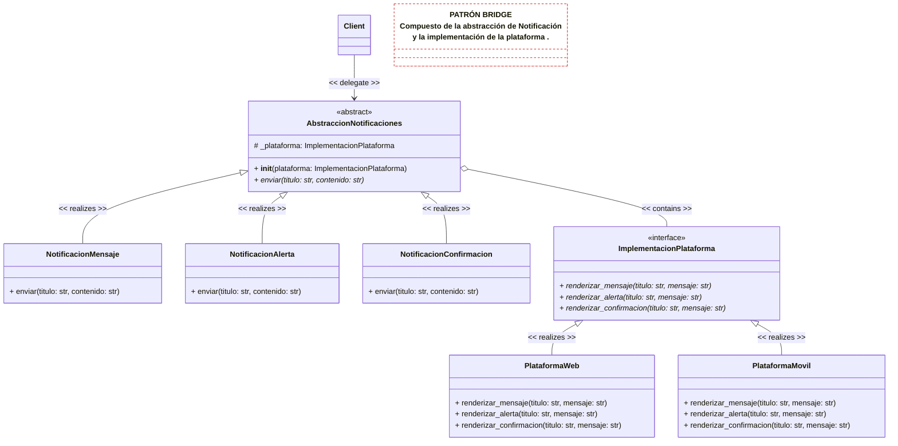

# ÍNDICE

* [1. EJERCICIO](#1-ejercicio)
    * [Escenario](#escenario)
    * [Problema](#problema)
    * [Beneficios](#beneficios-esperados-de-la-solución)
* [2. SOLUCIÓN](#2-solución)
    * [Análisis](#análisis)
      * [Factory Method](#factory-method)
      * [Builder](#builder)
    * [Decisiones](#decisiones)
      * [ADR](#adr-adopción-del-patrón-de-diseño-builder-para-la-creación-de-objetos-complejos)
      * [Contexto y Problema](#contexto-y-problema)
      * [Opciones Consideradas](#opciones-consideradas)
      * [Decisión Arquitectónica](#decisión-arquitectónica)
      * [Diagrama de Clases](#diagrama-de-clases)
      * [Consecuencias](#consecuencias)
* [3. MEJORA CONTINUA](#3-mejora-continua)
    * [Cuándo usar enfoque clásico o nativo en Python?](#cuándo-usar-cuál-en-python)
    * [El problema del Lienzo limpio](#el-lienzo-limpio-del-patrón-builder)

# 1. EJERCICIO

## Escenario:

Aplicación que gestiona la visualización de notificaciones en
diferentes plataformas (por ejemplo: escritorio, móvil, web). 
Las notificaciones pueden ser de distintos tipos (mensaje, 
alerta, advertencia, confirmación) y cada tipo puede mostrarse
de distintas formas según la plataforma.

## Problema:

Si usas herencia tradicional, tendrías que crear clases como:
- NotificacionMensajeWeb, NotificacionAlertaWeb, 
NotificacionMensajeMovil, NotificacionAlertaMovil, etc.

Esto lleva rápidamente a una explosión combinatoria de 
subclases difíciles de mantener.

## Beneficios esperados de la Solución

- *Separación de responsabilidades:* Separar la lógica de la 
notificación del medio por el que se presenta.
- *Escalabilidad:* Poder agregar nuevas plataformas o tipos 
de notificación sin modificar el resto del sistema.
- *Reducción de clases:* Evitar la multiplicación de clases 
para cada combinación.
- *Flexibilidad en tiempo de ejecución:* Poder cambiar la 
plataforma dinámicamente si es necesario. 

---

# 2. SOLUCIÓN

## Análisis
Identifico un problema estructural, razón por la cual acudo a los patrones estructurales, 
descartando Adapter (el problema no está relacionado con interfaces incompatibles), Decorator (
no está relacionado con objetos encapsuladores), Proxy (no está relacionado con un sustituto o 
marcador de posición), Flyweight (no tenemos restricciones de memoria RAM) quedandome 3 opciones 
para evaluar (Bridge, Facade y Composite).

Analizando la aplicabilidad de los patrones de diseño, tenemos:

### Bridge

**Propósito:**

Permite dividir una clase grande, o un grupo de clases estrechamente relacionadas, en dos 
jerarquías separadas (abstracción e implementación) que pueden desarrollarse 
independientemente la una de la otra.

**Se utiliza cuando:**
- Quiero dividir y organizar una clase monolítica que tenga muchas variantes de una sola 
funcionalidad (por ejemplo, si la clase puede trabajar con diversos servidores de bases de datos)
- Necesito extender una clase en varias dimensiones ortogonales (independientes).
- Necesito poder cambiar implementaciones durante el tiempo de ejecución. 

### Facade

**Propósito:** 

Proporcionar una interfaz simplificada a una biblioteca, un framework o cualquier otro grupo 
complejo de clases.

**Se utiliza cuando:**
- Necesito una interfaz limitada pero directa a un subsistema complejo.
- Quiero estructurar un subsistema en capas.

### Facade

**Propósito:**

Permite componer objetos en estructuras de árbol y trabajar con esas estructuras como si 
fueran objetos individuales.

**Se utiliza cuando:**
- Necesito implementar una estructura de objetos con forma de árbol.
- Quiero que el código cliente trate elementos simples y complejos de la misma forma.

---

## Decisiones

### ADR: Adopción del Patrón de Diseño Bridge para desacoplar abstracción e implementación

**Estado:** Aprobado  
**Fecha:** 17 de Mayo de 2026

#### Contexto y Problema

Requerimos una solución que gestione de manera independiente las plataformas de notificación
de los tipos de notificación, y que cada tipo pueda mostrarse de distintas formas según la 
plataforma, desarrollando de manera independiente la abstracción (tipo de notificación) 
y la implementación (plataforma).

#### Opciones Consideradas

1. Composición de Objetos con Enums con Dispatcher: Crear una clase única *Notificacion* con propiedades tipo
StrEnum: *TipoNotificacion* (Mensaje, Alerta) y Plataforma (Web, Movil) 
2. Patrón Abstract Factory: Crear una fábrica por cada plataforma, con lógica totalmente 
independiente
3. Patrón Bridge: Implementar una interfaz para la plataforma sin alterar el núcleo de notificaciones
y crear una clase base de notificaciones que referencie la implementación de la plataforma.

#### Decisión Arquitectónica

Se decide adoptar el **Patrón Bridge** para la implementación clases estrechamente relacionadas 
en dos jerarquías separadas (abstracción e implementación) que pueden desarrollarse 
independientemente la una de la otra.

### Diagrama de Clases

A continuación el diagrama de clases en formato mermaid:

#### Consecuencias

**Ventajas**
- *Principio de Responsabilidad Única (SOLID):* La lógica del negocio (mensajes) queda 
totalmente aislada de la lógica de infraestructura (plataforma).
- *Principio de Abierto/Cerrado (SOLID):* Puedo implementar nuevas plataformas y/o nuevos tipos
de notificaciones sin modificar las clases existentes.
- *Intercambio Dinámico:* Puedo cambiar la plataforma destino de la notificación en tiempo
de ejecución.
- 
**Desventajas**
- *Complejidad Inicial (Sobreingeniería):* Para el escenario particular podría identificar como 
sobreingeniería dado que son pocas plataformas y métodos de notificación. 
- *Contrato de Interfaz Rígido:* La interfaz obliga a todas las plataformas a implementar los 
mismos métodos, si una plataforma no soporta algún tipo de notificación debo lanzar excepciones.
- *Acoplamiento de Métodos:* Si se añade un método a la abstracción, tengo que actualizar 
obligatoriamente la interfaz de la plataforma y sus clases hijas.

## 3. MEJORA CONTINUA

Para el escenario con métodos tan similares (dado que uso print para renderizar el mensaje, 
es evidente que hay "code smells", en éste caso, cada implementación de plataforma debe 
implementar sus propios métodos de renderizado de mensaje y dichos métodos en éste caso 
simple son idénticos, lo que varía es parte del mensaje atado a la plataforma, por lo demás 
es exactamente igual (llamaría a la refactorización de código). Ésto se puede corregir de varias formas,
una sería con la implementación de un formateador de texto externo, asegurando el enfoque de 
composición, mejorarndo la legibilidad y complejidad, sin embargo, es más común encontrar que 
éste patrón de Bridge se implemente junto a otros patrones, en éste caso, encajaría muy bien 
con un patrón como ***Template Method*** dado que los algoritmos de renderizado del mensaje son
casi idénticos (diferencias mínimas) y nos permitiría contrlar la edición de todas las clases 
cuando el algoritmo cambie.

NOTA: En caso de que cada plataforma implemente métodos con grandes diferencias no sería tan 
notorio éste hallazgo que además el IDE también lo notifica (ésto se debe a que el fin es académico
y por tal motivo el renderizado completo para las 3 notificaciones en los 2 plataformas lo hago
con un print, pero en un caso real, estaría usando APIs y librerías diferentes.