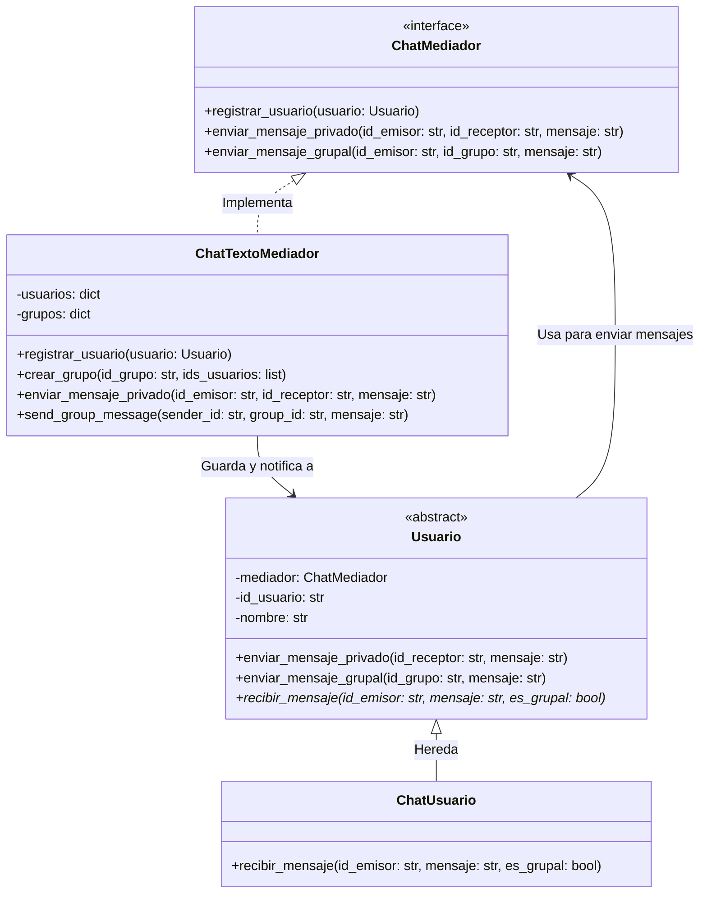

# ÍNDICE

* [1. EJERCICIO](#1-ejercicio)
    * [Escenario](#escenario)
    * [Problema](#problema)
    * [Beneficios](#beneficios-esperados-de-la-solución)
* [2. SOLUCIÓN](#2-solución)
    * [Análisis](#análisis)
    * [Decisiones](#decisiones)
      * [ADR](#adr-adopción-del-patrón-de-diseño-builder-para-la-creación-de-objetos-complejos)
      * [Contexto y Problema](#contexto-y-problema)
      * [Opciones Consideradas](#opciones-consideradas)
      * [Decisión Arquitectónica](#decisión-arquitectónica)
      * [Diagrama de Clases](#diagrama-de-clases)
      * [Consecuencias](#consecuencias)
* [3. MEJORA CONTINUA](#3-mejora-continua)

# 1. EJERCICIO

## Escenario:

Aplicación de chat grupal. Los usuarios pueden enviarse mensajes
entre sí dentro de una sala de chat. Sin embargo, gestionar las 
interacciones directas entre cada usuario haría que cada uno deba 
conocer y comunicarse con todos los demás, lo que resulta en una 
alta dependencia entre objetos.

## Problema:

Sin un mediador, cada usuario tendría que mantener referencias directas 
a todos los demás, lo que genera un sistema difícil de escalar y mantener. 
Si agregas o eliminas usuarios, debes actualizar muchas relaciones.

## Beneficios esperados de la Solución

- *Facilita el mantenimiento:* Agregar o eliminar usuarios no debe requerir 
modificar los demás.
- *Mejor organización:* La lógica de comunicación debe estar centralizada, 
no dispersa en muchos objetos.
- *Reduce la complejidad:* Evitar una red enmarañada de interacciones punto 
a punto.

---

# 2. SOLUCIÓN

## Análisis

Identifico un problema de comportamiento, razón por la cual acudo a los patrones 
comportamentales, y dado el problema podría suscribir los usuarios a un "canal"
para comunicarse entre sí que tal vez un patrón como Observer podría resolver, 
pero al escalar tendríamos una sobrecarga con las suscripciones mientras no se
están transmitiendo comunicaciones.

Analizando más a fondo el caso, la necesidad de un mediador encaja perfectamente 
con el patrón *mediator* con el que podemos orquestar el mensaje en lugar de
recibir peticiones continuas con un suscriptor sin tener un mensaje para entregar.

### Mediador

**Propósito:**

Te permite reducir las dependencias caóticas entre objetos. El patrón restringe 
las comunicaciones directas entre los objetos, forzándolos a colaborar 
únicamente a través de un objeto mediador.

**Se utiliza cuando:**
- Resulte difícil cambiar algunas de las clases porque están fuertemente 
acopladas a un puñado de otras clases.
- No puedas reutilizar un componente en un programa diferente porque sea 
demasiado dependiente de otros componentes
- Te encuentres creando cientos de subclases de componente sólo para 
reutilizar un comportamiento básico en varios contextos

---

## Decisiones

### ADR: Adopción del Patrón de Diseño Bridge para desacoplar abstracción e implementación

**Estado:** Aprobado  
**Fecha:** 22 de Mayo de 2026

#### Contexto y Problema

Necesitamos una solución que nos permita escalar en las interacciones entre objetos
para reutilizar comportamiento básico entre varios contextos de chat, ya que los
usuarios no sólo comparten en un chat grupal sino que también podrán comunicarse
entre ellos de manera directa.

#### Opciones Consideradas

1. Manejo de eventos simples: Considerar el uso de eventos nativo del lenguaje
de programación. Los mensajes serían gestionados a través del gestor de eventos
2. Funciones puras de entrega: Generar una clase de herramientas que solo reciba 
3 datos (ID_Origen, ID_Destino y Mensaje), orquestar con éstos IDs.

#### Decisión Arquitectónica

Se decide adoptar el **Patrón Mediator** para reducir las dependencias caóticas 
entre objetos (usuarios), colaborando exclusivamente a través de un objeto mediador
para la comunicación del mensaje, permitiendo encapsular la compleja red de 
relaciones entre varios objetos (usuario) dentro de un único objeto mediador. 
Cuantas menos dependencias tengo en la clase, más fácil es modificar, extender 
o reutilizar esa clase.

### Diagrama de Clases

A continuación el diagrama de clases en formato mermaid:

#### Consecuencias

**Ventajas**
- *Menor acoplamiento:* Los usuarios no necesitan conocer la existencia de los 
otros usuarios en memoria. Solo conocen al Mediador.
- *Facilidad para escalar:* Si agregas un usuario nuevo, no tienes que actualizar 
a los demás usuarios. Solo registras al nuevo en el Mediador.
- *Reutilización de código:* Puedes cambiar las reglas de cómo se envían los 
mensajes en un solo lugar.

**Desventajas**

- *Punto único de falla:* Si el Mediador falla, todo el sistema de chat se cae 
por completo.
- *Complejidad centralizada:* Con el tiempo, el Mediador puede volverse muy grande 
y difícil de mantener si le agregas demasiadas tareas.
- *Cuello de botella:* Si miles de usuarios envían mensajes al mismo tiempo, el 
Mediador puede saturarse si no está bien optimizado.

## 3. MEJORA CONTINUA
