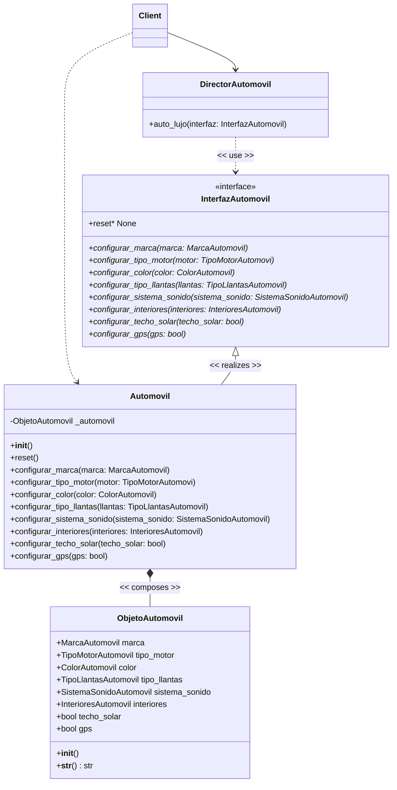

# ÍNDICE

* [1. EJERCICIO](#1-ejercicio)
    * [Escenario](#escenario)
    * [Problema](#problema)
    * [Beneficios](#beneficios-esperados-de-la-solución)
* [2. SOLUCIÓN](#2-solución)
    * [Análisis](#análisis)
      * [Factory Method](#factory-method)
      * [Builder](#builder)
    * [Decisiones](#decisiones)
      * [ADR](#adr-adopción-del-patrón-de-diseño-builder-para-la-creación-de-objetos-complejos)
      * [Contexto y Problema](#contexto-y-problema)
      * [Opciones Consideradas](#opciones-consideradas)
      * [Decisión Arquitectónica](#decisión-arquitectónica)
      * [Diagrama de Clases](#diagrama-de-clases)
      * [Consecuencias](#consecuencias)
* [3. MEJORA CONTINUA](#3-mejora-continua)
    * [Cuándo usar enfoque clásico o nativo en Python?](#cuándo-usar-cuál-en-python)

# 1. EJERCICIO

## Escenario:

Aplicación para una compañía automotriz que permite a los clientes personalizar y ordenar un automóvil. 
Un objeto Automóvil puede tener muchas configuraciones opcionales: tipo de motor, color, llantas, 
sistema de sonido, interiores, techo solar, navegación GPS, etc.

## Problema:

Crear un objeto Automóvil con múltiples configuraciones puede llevar a constructores con
muchos parámetros (el infame "constructor telescópico") o a múltiples constructores
sobrecargados, lo que dificulta el mantenimiento y legibilidad del código.

## Beneficios esperados de la Solución

- *Legibilidad y claridad:* Facilitar la creación de objetos complejos con muchos
parámetros sin necesidad de múltiples constructores o valores por defecto.
- *Inmutabilidad:* Una vez creado el objeto, sus propiedades no se pueden modificar si
el constructor lo define como inmutable.
- *Flexibilidad:* Poder omitir atributos opcionales sin necesidad de crear subclases o
múltiples constructores.
- *Separación de construcción y representación:* Separar la lógica de construcción del
objeto en sí, facilitando modificaciones futuras.

---

# 2. SOLUCIÓN

## Análisis
Identifico un problema creacional, razón por la cual acudo a los patrones creacionales, 
descartando singleton (el problema no corresponde al de una única instancia), Prototype (
no requiero copiar objetos existentes), Abstract Factory (no tengo un problema de familias
de objetos), quedandome 2 opciones para evaluar (Factory Method y Builder).

Analizando la aplicabilidad de ambos patrones de diseño tenemos:

### Factory Method

**Propósito:**

Proporciona una interfaz para crear objetos en una superclase, mientras permite a las 
subclases alterar el tipo de objetos que se crearán.

**Se utiliza cuando:**
- No conozca de antemano las dependencias y los tipos exactos de objetos con los que 
debe funcionar el código.
- Quiero ofrecer a los usuarios de la biblioteca o framework, una forma de extender sus 
componentes internos.
- Quiero ahorrar recursos del sistema mediante la reutilización de objetos existentes en 
lugar de reconstruirlos cada vez.

### Builder

**Propósito:** 

Permite construir objetos complejos paso a paso. El patrón nos permite producir distintos 
tipos y representaciones de un objeto empleando el mismo código de construcción.

**Se utiliza cuando:**
- Requieres evitar un *"consutructor telescópico"*
- Requieres que el código sea capaz de crear distrintas representaciones de ciertos 
productos (por ejemplo, casas de piedra y de madera)
- Requieres construir árboles con el patrón Composite u otros objetos complejos

---

## Decisiones

### ADR: Adopción del Patrón de Diseño Builder para la Creación de Objetos Complejos

**Estado:** Aprobado  
**Fecha:** 14 de Mayo de 2026

#### Contexto y Problema

En el módulo principal de nuestro sistema, necesitamos instanciar el objeto 
Automovil, el cual requiere varios atributos de configuración diferentes (algunos 
obligatorios y otros opcionales). Usar un constructor tradicional de la clase nos 
llevará a una situación de "constructores telescópicos" o en su defecto a pasar
múltiples valores *null* por parámetros no deseados (propenso a errores y 
dificultando el mantenimiento del código).

#### Opciones Consideradas

1. Constructores Múltiples (telescópicos): Crear un constructor diferente para
cada posible combinación de parámetros.
2. Setters Públicos post-instalación: Crear un constructor vacío y asignar los 
valores cion métodos *set*.
3. Patrón Builder: Encapsular la lógica de construcción en una clase separada 
e implementar una interfaz fluida.

#### Decisión Arquitectónica

Se decide adoptar el **Patrón Builder** para la construcción de objetos complejos 
y de configuración. Se implementa con una interfaz fluida que permita encadenar
métodos y finalizar con un método build().

### Diagrama de Clases

A continuación el diagrama de clases en formato mermaid:

<div style="max-width: 85%; margin: 0 auto;">


</div>

#### Consecuencias

**Ventajas**
- **Legibilidad:** El código es mucho más descriptivo. Se sabe exactamente qué 
atributo se está configurando sin importar el orden.
- **Mantenibilidad:** Si a *Automovil* se le añaden nuevos atributos en el 
futuro, no es necesario modificar o romper los constructores existentes.
- **Inmutabilidad:** Permite que el objeto final (Automovil) sea inmutable al 
tener todos sus atributos como final, ya que los valores se asignan en el 
constructor del builder.
- **Validaciones:** Se pueden incluir validaciones de los datos dentro de la 
clase builder antes de construir el objeto final.

**Desventajas**
- **Complejidad Inicial:** Añade más clases y líneas de código base a nuestro 
proyecto.
- **Uso Indebido:** Puede agregar complejidad innecesaria si se aplica a 
objetos muy simples que tienen pocos atributos.

---

## 3. MEJORA CONTINUA

En python se cuenta con éste patrón de forma nativa y se implementa de la 
siguiente manera (Tener presente en nuevas implementaciones, considerando 
el conocimiento de la estructura original del patrón para identificarlo en
otros lenguajes de programación y/o soluciones existentes:

```python
from dataclasses import dataclass, field
from typing import List

@dataclass(frozen=True)  # frozen=True hace que el automóvil sea inmutable
class Automovil:
    # Parámetros obligatorios (sin valor por defecto)
    marca: str
    modelo: str
    
    # Parámetros opcionales con valores por defecto
    color: str = "Blanco"
    motor: str = "1.6L Gasolina"
    transmision: str = "Manual"
    techo_solar: bool = False
    
    # Para tipos mutables como listas, se usa default_factory
    asistencias_conduccion: List[str] = field(default_factory=list)
```

### Cuándo usar cuál en Python?

Usa el *Enfoque Clásico* si la creación del objeto requiere un orden estricto 
de pasos, llamadas a APIs externas durante el proceso, o validaciones cruzadas 
complejas antes de instanciar.

Usa el Enfoque Nativo (dataclasses) si solo buscas evitar constructores gigantes 
y quieres mantener el código limpio, simple y legible.

### El ***"Lienzo Limpio"*** del patrón BUILDER

Imagina que el Builder es un robot en una línea de ensamblaje. Si el robot 
termina un auto y lo entrega sin limpiar su plataforma de trabajo, la 
siguiente vez que le pidas construir un auto diferente (por ejemplo, uno 
económico sin GPS), el robot usará la plataforma vieja y el nuevo auto saldrá 
con el GPS del cliente anterior. El método get_automovil() tiene dos 
responsabilidades obligatorias: 
- Entregar el auto actual que se construye.
- Garantizar que el Builder quede inmediatamente listo (en blanco) para el 
próximo trabajo. 

Como la instrucción return finaliza por completo la ejecución de cualquier 
método, no puedes poner código después de un return. Por lo tanto, la única 
forma matemática de hacer ambas cosas es: python def get_automovil(self) -> 
Automovil:
1. Copias la dirección de memoria del auto terminado
    producto = self._automovil   
2. Desvinculas al Builder de ese auto y creas uno nuevo vacío
    self.reset()          
3. Entregas la copia que salvaste en el paso 1
    return producto        

Usa el código con precaución. Al asignar producto = self._automovil, Python no 
duplica el auto en memoria, solo crea un "puntero" o acceso directo hacia él. 
Así, cuando el reset() borra self._automovil, el auto real no se destruye porque 
la variable producto todavía lo mantiene vivo para poder entregártelo en el Main.
